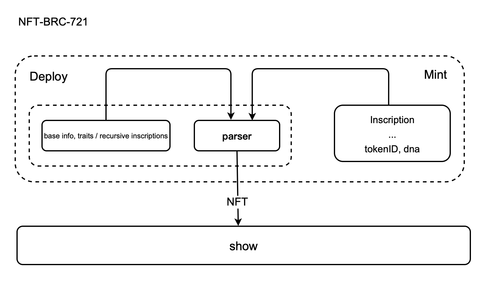
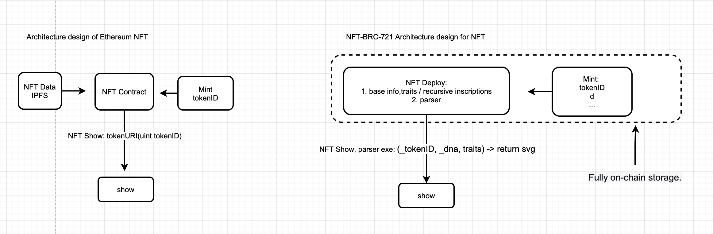
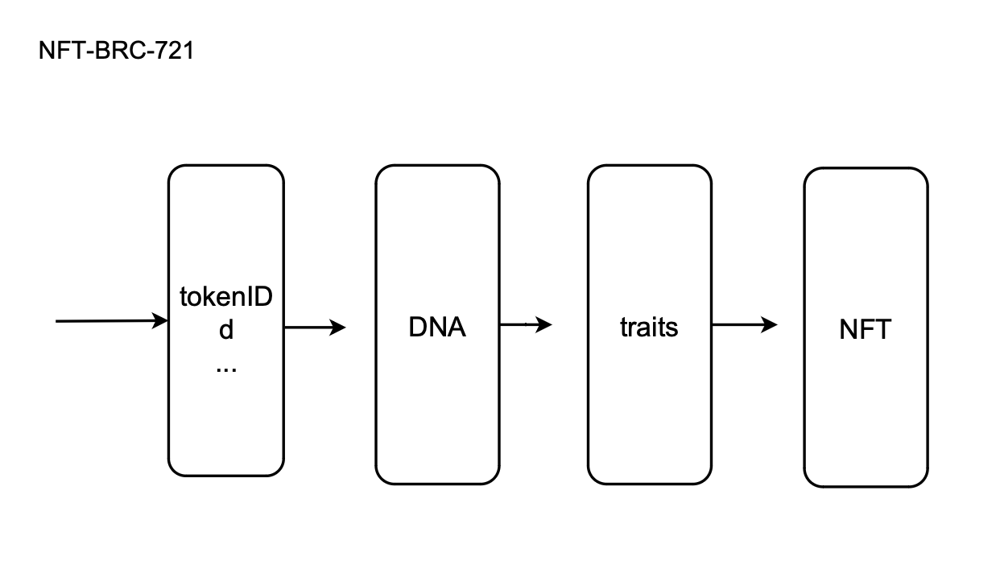

# NFT-BRC-721

nft-brc-721 (abbreviated as nbrc-721) is a set of NFT protocols specifically designed for the ordinals ecosystem, aiming to solve the following problems:

1. NFT data is stored entirely on-chain.
2. NFT data stored on-chain should be as small as possible.
3. NFTs should not only be images, but also have their own names and quantities, and more importantly, they should have randomness and uniqueness.

## Features of nft-brc-721

1. Fully on-chain storage.
2. Minting an NFT reduces the block space occupancy by more than 97% (Reference 1000 Matchstick People) .
3. Randomness: We introduce the concept of DNA for NFTs, and the characteristics of NFTs are determined only after they are minted.
4. Unified interface for easy integration: Only 2 lines of code are needed for the frontend to display NFTs. Third-party platforms can easily integrate.
5. Stronger extensibility: We introduce the concept of a parser on-chain, and developers can implement their own parsers in the interface.

## Implementation


### The design architecture of NFT-BRC-721
The NFT data on the chain is divided into three structural levels.
1. Base info, traits  
2. Parser
3. Mint inscription


### Comparison of Ethereum NFT and NFT-BRC-721



### 1. Deploy

Deployment is a JSON file, mainly containing three parts:

   a. Basic information of the NFT.  
   b. Traits of the NFT / recursive inscription array, which exist in base64 format.  
   c. Parser: The parser is a function with a unified interface, stored on-chain in base64 format. The frontend can directly obtain images through the parser.  
   The main function of the parser is to generate the final NFT based on the tokenID and DNA of the NFT. Example code for the parser:  
    
    `(_tokenID, _dna, traits) => {  
      //code  
      ......  
      return svg;  
    }
    `

| Key         | Required | Description                                                  |
| ----------- | -------- | ------------------------------------------------------------ |
| p           | YES      | value: nft-brc-721 |
| op          | YES      | value: deploy |
| tick        | YES      | The name of the NFT collection, such as CryptoPunks |
| supply      | YES      | NFT maximum quantity of supply |
| v           | YES      | Protocol version, backward compatible |
| traits      | YES      | NFT traits / Recursive inscriptions,string,base64 |
| parser      | YES      | NFT parser,string, base64 |


### 2. Mint

The mint file of nft-brc-721 is based on the implementation of the brc20 mint file, with the following format:

`{
"p": "nft-brc-721",
"op": "mint",
"tick": "Matchstick People",
"in": "",
"id": "0",
"d": "geek"
}`  

| Key         | Required | Description                                                  |
| ----------- | -------- | ------------------------------------------------------------ |
| p           | YES      | value: nft-brc-721 |
| op          | YES      | value: mint |
| tick        | YES      | The name of the NFT collection, such as "Matchstick People" |
| in          | YES      | The inscription deploy of NFT |
| id          | YES      | ID of NFT, reference tokenID of Ethereum NFT. |
| d           | YES      | Represents a part of the DNA, the user input, the user is advised to enter their own name. |


### 3. Display

Call "parser" in the deploy file and pass in the parameters "id","d","traits" for "parser". "parser" will return svg.
Example code:  
```
{  
    //code  
    const make_nft = eval((atob(nft_deploy_data.parser)))(nft_mint_data.id,nft_mint_data.d,JSON.parse(atob(nft_deploy_data.traits)));
    showNFT(make_nft);
}  
```  

## For the effect of using nft-brc-721 on block space
Let's use the example of Matchstick People NFTs for comparison. The size of the data for Matchstick People NFTs is not completely consistent, ranging from 8kb to 14kb, with a median value of 11kb. 

If there are 1000 Matchstick People NFTs, the total space occupied would be 1000 * 11 = 11000kb. 

If Matchstick People NFTs use NFT-BRC-721, what would be the total space occupied? The deployment file is 65kb, and the mint file is 160b. 

The total space occupied would be: 65kb + 160 * 1000/1000 = 225kb. 

Comparing the two: 

Percentage decrease in storage space: (11000-225)/11000 * 100 = 97.95%.
  

## Randomness of NFT === DNA
DNA is the digitalized description of NFT, and DNA is unique. Taking the Matchstick People NFT as an example, the probability of two Matchstick People being the same is less than 1/10,000,000,000.
The implementation of DNA is not fixed,  Matchstick People is only a demonstration method.



## Verify the feasibility of NFT-BRC-721
We deployed  Matchstick People NFT to demonstrate how the NFT-BRC -721 works and how well it optimizes the block space.
deploy:
https://ordinals.com/inscription/d4d2aba4b99288c0e925ec7f5b5a8fd13ccf3069a05ec7fad1536df242d7bcc1i0
mint:
https://ordinals.com/inscription/cf67483000b3ac3791f580c7c7b421b75f5638a2630a85e1829cac0dd29bd406i0


## Summary
In summary, the nft-brc-721 protocol is a set of NFT protocols with features such as fully on-chain storage, block space occupancy reduced by more than 95%, randomness, unified interface, and stronger extensibility. The implementation mainly consists of deploy, mint, and display layer components. The parser is a function with a unified interface, stored on-chain in base64 format, and the frontend can directly obtain images through the parser.